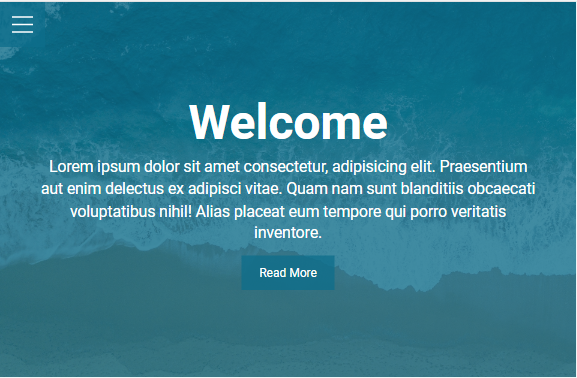

## Hamburger Menu mini project

The next mini project for learning HTML & CSS. [Project Demo](https://kayyrbeks.github.io/udemy-courses/01-modern-html-css/04-hamburger-menu/index.html)

## List of contents

- [Screenshot](#screenshot)
- [Project stack](#project-stack)

### Screenshot

### Project stack

- HTML5 markup;
- CSS custom properties;
- Flexbox.
