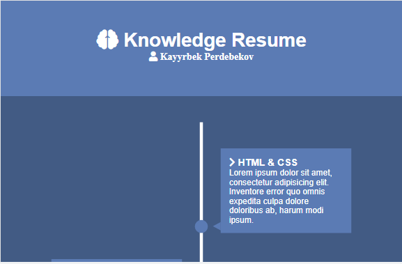

## Knowledge Timeline mini projects

The next mini project for learning HTML & CSS. [Project Demo](https://kayyrbeks.github.io/udemy-courses/01-modern-html-css/05-knowledge-timeline/index.html)

## List of contents

- [Screenshot](#screenshot)
- [Project stack](#project-stack)

### Screenshot

### Project stack

- HTML5 markup;
- CSS custom properties;
- JS code (not explained);
